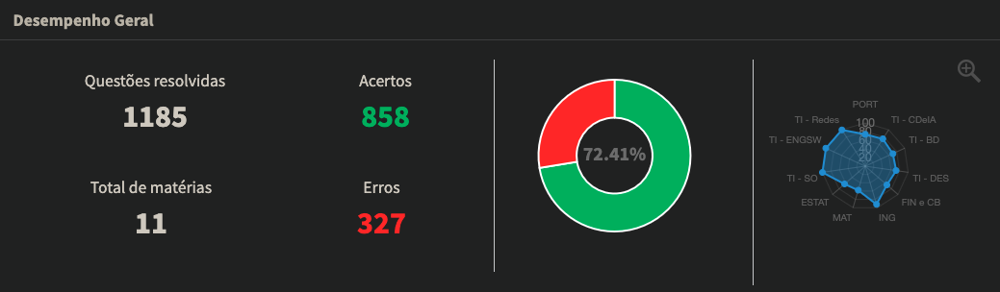

A constância sempre ganha do talento no longo prazo. Poucas coisas na vida podem ser conquistadas de forma imediata e sem nenhum esforço significativo despendido, se você é uma pessoa fora da curva a história é bem diferente -- não é o meu caso.

Algo que tem me ajudado muito a manter essa constância é uma rotina muito bem estabelecida, eu não cronometro meus horários, mas tenho muito bem definido o que deve ser feito, a partir disso consigo organizar os horários do meu dia de forma muito dinâmica, obviamente seguindo um padrão, mas sendo flexível a imprevistos que por ventura possam vir a ocorrer. O porquê disso me ajudar a manter a constância fica muito claro: eu não penso muito em como me organizar, eu simplesmente vou lá e faço.

Voltei a estudar ativamente para provas de concurso público -- focando no concurso do Branco do Brasil para trabalhar como Agente de Tecnologia da Informação -- fazem cerca de 2 meses, e digo que fiquei apenas *um único dia* sem estudar, por um imprevisto envolvendo minhas demandas da faculdade, junto com demandas da minha pesquisa, que acabaram se acumulando. No [post passado](/2026-01-31/) sobre estudos eu elenquei as ferramentas e práticas nas quais eu executava para tornar meu estudo mais efetivo; mantive pouquíssimas práticas das quais estavam listadas na postagem, abandonei completamente o uso de anotações como um "segundo cérebro", teoricamente o fluxo natural para evitar o esquecimento é revisitar suas anotações, correto? Eu penso que não. Pelo menos para a **minha pessoa** o fluxo natural para evitar esse esquecimento é a **prática**, fazer questões constantemente dentro do meu ciclo de estudos é muito mais efetivo do que ler e reler para tentar lembrar o conteúdo estudado; na minha opnião, a intuição para resolver questões não é algo materializável, é bem pessoal de cada pessoa, e é algo que só se aprende fazendo, algo que nenhum resumo vai te proporcionar. Nesses dois meses não me recordo de ter anotado absolutamente nada. A ideia central é depender o mínimo possível de anotações, a memória deve ser preservada por meio da prática, o contato com a teoria escrita deve ser feito apenas uma vez.

Nesses últimos dois meses fiz 1185 questões no Tec Concursos, que site bom, os filtros dão de 10 a 0 no QConcursos. Deixo abaixo a imagem das minhas estatísticas, com o puro intuito de mostrar que a constância é o único caminho possível.

Minha quantidade de acertos em português era péssima, foi a matéria na qual eu mais evoluí nesse tempo. Atualmente estou dando enfoque apenas nas matérias de mais custo x benefício no concurso, deixando de lado -- por enquanto -- as outras matérias, como por exemplo desenvolvimento mobile; não deixo de fazer questões desses assuntos, mas faço em menor volume. A matéria de conhecimentos bancários, por exemplo, não está na minha lista de prioridades atual e deverá entrar apenas quando eu finalizar os conteúdos do ciclo de matérias com maior custo x benefício, ou seja, vou diminuir o tempo bruto no qual essas matérias ocupam no meu ciclo para alocar a matéria nova, de menor custo benefício, diante disso, o tempo que era despendido para a matéria, dividido entre teoria e prática, vai ser apenas para a prática pois a teoria já foi finalizada. Eu costumo anotar tudo isso dentro de uma planilha, nada muito complexo.

Seguindo esse fluxo, sinceramente nem penso mais se devo ou não fazer, eu simplesmente faço. Esse é o caminho para alcançar qualquer coisa na vida.
