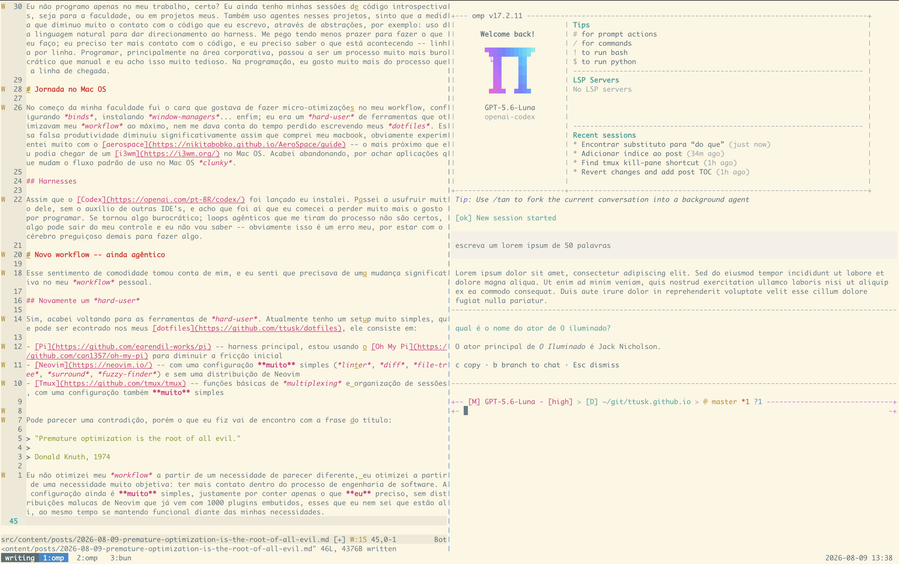

# Contexto

Já faz um certo tempo que me pego programando usando apenas agentes, programo principalmente no meu trabalho, portanto o que faço é visando apenas os resultados gerados pelo trabalho. A velocidade de desenvolvimento aumenta muito, a fricção é muito menor para as demandas saírem do Kanban e irem direto para a tela do usuário, porém, em contrapartida os prazos se tornam significativamente menores, dado que consigo agregar mais valor em um tempo menor, tenho menos margem para experimentar coisas novas e logicamente tenho menos contato com a escrita "artesanal" do código.

Eu não programo apenas no meu trabalho, certo? Eu ainda tenho minhas sessões de código introspectivas, seja para a faculdade, ou em projetos meus. Também uso agentes nesses projetos, sinto que a medida que diminuo muito o contato com o código que eu escrevo, através de abstrações (uso da linguagem natural para dar direcionamento ao agente). Me pego tendo menos prazer para fazer o que eu faço; eu preciso ter mais contato com o código, e eu preciso saber o que está acontecendo -- linha por linha. Programar, principalmente na área corporativa, passou a ser um processo muito mais burocrático que manual e eu acho isso tedioso; para alguém que gosta do processo de programar, prazos cada vez mais curtos são um porre.

# Jornada no Mac OS

No começo da minha faculdade fui o cara que gostava de fazer micro-otimizações no meu workflow, configurando *binds*, instalando *window-managers*... enfim; eu era um *hard-user* de ferramentas que otimizavam meu *workflow* ao máximo, nem me dava conta do tempo perdido escrevendo meus *dotfiles*. Essa falsa produtividade diminuiu significativamente assim que comprei meu macbook, obviamente experimentei muito com o [aerospace](https://nikitabobko.github.io/AeroSpace/guide) -- o mais próximo que eu podia chegar de um [i3wm](https://i3wm.org/) no Mac OS. Acabei abandonando, por achar aplicações que mudam o fluxo padrão de uso no Mac OS muito *clunky*.

## Harnesses

Assim que o [Codex](https://openai.com/pt-BR/codex/) foi lançado eu instalei. Passei a usufruir muito dele, sem o auxílio de outras IDE's, e acho que foi aí que eu comecei a perder muito mais o gosto por programar. Se tornou algo burocrático; loops agênticos que me tiram do processo não são certos, algo pode sair do meu controle e eu não vou saber -- obviamente isso é um erro meu, por estar com o cérebro preguiçoso demais para fazer algo.

# Novo workflow -- ainda agêntico

Esse sentimento de comodidade tomou conta de mim, e eu senti que precisava de uma mudança significativa no meu *workflow* pessoal.

## Novamente um *hard-user*

Sim, acabei voltando para as ferramentas de *hard-user*. Atualmente tenho um setup muito simples, esse que pode ser encontrado nos meus [dotfiles](https://github.com/ttusk/dotfiles), ele consiste em:

- [Pi](https://github.com/earendil-works/pi) -- harness principal, estou usando o [Oh My Pi](https://github.com/can1357/oh-my-pi) para diminuir a fricção inicial
- [Neovim](https://neovim.io/) -- com uma configuração **muito** simples (*linter*, *diff*, *file-tree*, *surround*, *fuzzy-finder*) e sem uma distribuição de Neovim
- [Tmux](https://github.com/tmux/tmux) -- funções básicas de *multiplexing* e organização de sessões, com uma configuração também **muito** simples

Pode parecer uma contradição, porém o que eu fiz vai de encontro com a frase do título:

> "Premature optimization is the root of all evil."
>
> Donald Knuth, 1974

Eu não otimizei meu *workflow* a partir de um necessidade de parecer diferente, eu otimizei a partir de uma necessidade muito objetiva: ter mais contato dentro do processo de engenharia de software. A configuração ainda é **muito** simples, justamente por conter apenas o que **eu** preciso, sem distribuições malucas de Neovim que já vem com 1000 plugins embutidos, esses que eu nem sei que estão ali, ao mesmo tempo se mantendo funcional diante das minhas necessidades. A minha ideia é fazer um *pair-programming* com o agente, ao invés de settar um `/goal` e rezar pelo melhor -- rs.

## Imagem do *setup*

Para variar, eu ainda assim não vou conseguir programar em Java usando esse *setup* (-_-)
